

# Dev_Setup
Setup Development Environment

#Assignment: Setting Up Your Developer Environment

#Objective:
This assignment aims to familiarize you with the tools and configurations necessary to set up an efficient developer environment for software engineering projects. Completing this assignment will give you the skills required to set up a robust and productive workspace conducive to coding, debugging, version control, and collaboration.

#Tasks:

1. Select Your Operating System (OS):
   Choose an operating system that best suits your preferences and project requirements. Download and Install Windows 11. https://www.microsoft.com/software-download/windows11

Step 0

Before you installing Windows 11, you should make sure your PC is ready and that all your personal data is secure.
First, check that your system can support it. 

WHAT DO YOU NEED.

Windows installation media. This could be an installation ISO or DVD.
USB flash drive with at least 5GB free space,ensure the flash disk has nothing important since it will be formatted.
Technician PC - Windows PC that you'll use to format the USB flash drive
Destination PC - A PC that you'll install Windows on

Step 1 - Format the drive and set the primary partition as active.

Connect the USB flash drive to your technician PC.
Open Disk Management: Right-click on Start and choose Disk Management.
Format the partition: Right-click the USB drive partition and choose Format. Select the FAT32 file system to be able to boot either BIOS-based or UEFI-based PCs.
Set the partition as active: Right-click the USB drive partition and click Mark Partition as Active.

Step 2 - Copy Windows Setup to the USB flash drive.

Use File Explorer to copy and paste the entire contents of the Windows product DVD or ISO to the USB flash drive.
Optional: add an unattend file to automate the installation process. For more information, see Automate Windows Setup.

Step 3 - Install Windows to the new PC.

Connect the USB flash drive to a new PC.
Turn on the PC and press the key that opens the boot-device selection menu for the computer, such as the Esc/F10/F12 keys. Select the option that boots the PC from the USB flash drive.
Windows Setup starts. Follow the instructions to install Windows.
Remove the USB flash drive.

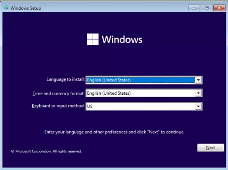
Specify the language,time,and currency format as well as keyboard method to continue

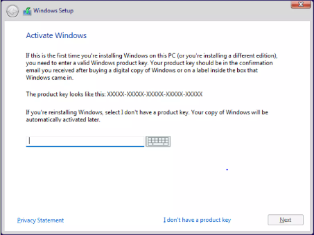

Choose installation type

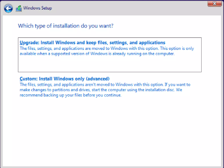 
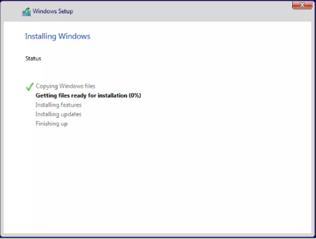
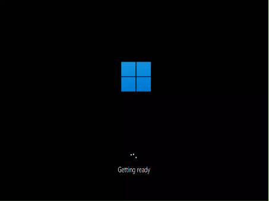
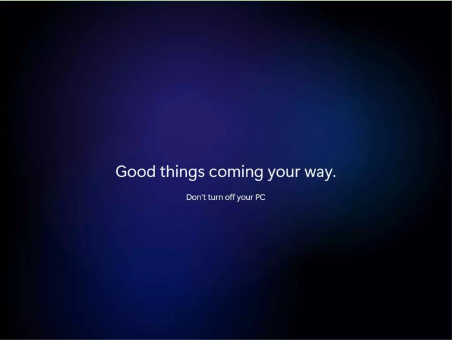

2. Install a Text Editor or Integrated Development Environment (IDE):
   Select and install a text editor or IDE suitable for your programming languages and workflow. Download and Install Visual Studio Code. https://code.visualstudio.com/Download

Step 2: Press the “Download for Windows” button on the website to start the download of the Visual Studio Code Application.

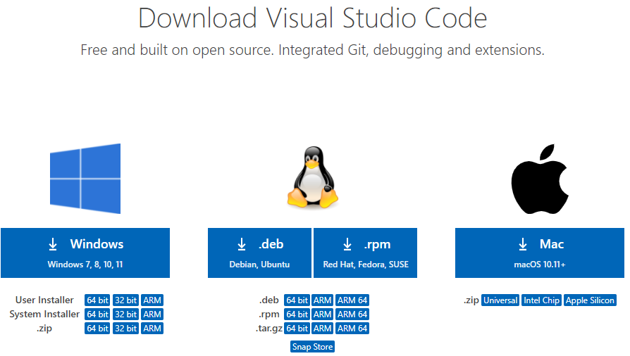

Step 3: When the download finishes, then the Visual Studio Code Icon appears in the downloads folder.
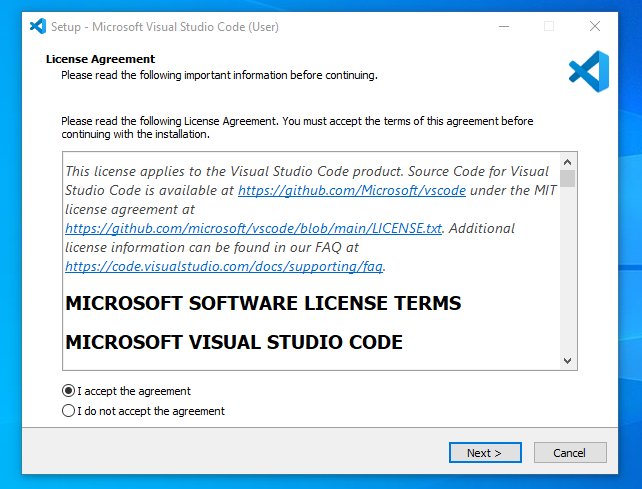

Step 4: Click on the Installer icon to start the installation process of the Visual Studio Code.

Step 5: After the Installer opens, it will ask you to accept the terms and conditions of the Visual Studio Code. Click on I accept the agreement and then click the Next button.
Step 6: Choose the location data for running the Visual Studio Code. It will then ask you to browse the location. Then click on the Next button.

Step 7: Then it will ask to begin the installation setup. Click on the Install button.

Step 8: After clicking on Install, it will take about 1 minute to install the Visual Studio Code on your device.

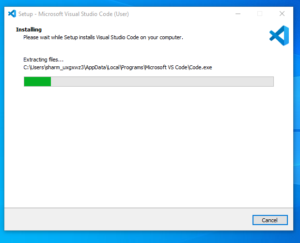

Step 9: After the Installation setup for Visual Studio Code is finished, it will show a window like this below. Tick the “Launch Visual Studio Code” checkbox and then click Next.

Step 10: After the previous step, the Visual Studio Code window opens successfully. Now you can create a new file in the Visual Studio Code window and choose a language of yours to begin your programming

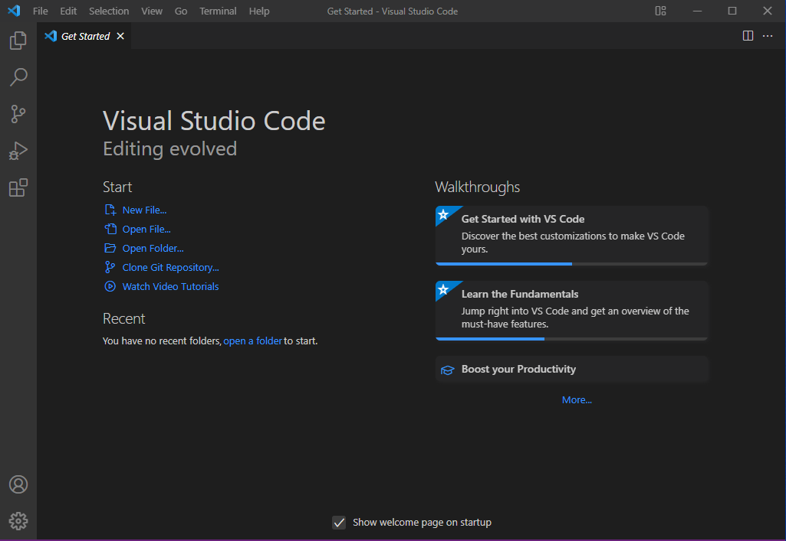

3. Set Up Version Control System:
   Install Git and configure it on your local machine. Create a GitHub account for hosting your repositories. Initialize a Git repository for your project and make your first commit. https://github.com

Version Control: It offers seamless integration with Git and other version control systems, allowing
developers to manage source code repositories, perform version control operations, and resolve
merge conflicts without leaving the editor.Open Folder. 

File > Open Folder (Ctrl+K Ctrl+O)
Source Control. View > Source Control (SCM) (Ctrl+Shift+G)
Initialize repository. main is the default branch.
Open the Command Palette. View > Command Palette (Ctrl+Shift+P)
Rename a branch.
File version control status. 
Commit file.
Create a branch.

4. Install Necessary Programming Languages and Runtimes:
  Instal Python from http://wwww.python.org programming language required for your project and install their respective compilers, interpreters, or runtimes. Ensure you have the necessary tools to build and execute your code.

  -Download the python installer from python website
  -Double clicking to install.
  -set up the path for python
  -check python if its working well on cmd or git bash

5. Install Package Managers:
   If applicable, install package managers like pip (Python).

   To install packages on vs code we use git bash and run: python -m pip install django

6. Configure a Database (MySQL):
   Download and install MySQL database. https://dev.mysql.com/downloads/windows/installer/5.7.html

 we download mysql installer from the link given above. select community installation and wait for download to finish.
 Once you select the option, the service will prompt you to register an Oracle web account or log in with your existing data. You can skip this step.  once done downloaded you double click on it to install. To install the MySQL database. select  custom and continue with the installation.
  Select mysql server,mysql workbench, and mysql shell and contine with the installation.
  Continue to follow the instructions

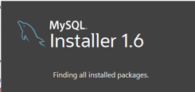
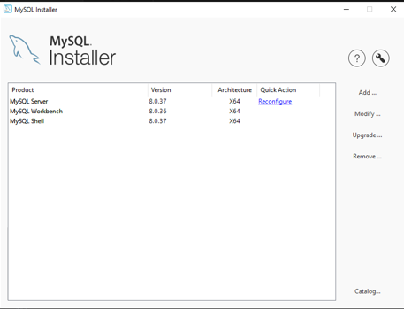

7. Set Up Development Environments and Virtualization (Optional):
   Consider using virtualization tools like Docker or virtual machines to isolate project dependencies and ensure consistent environments across different machines.

Step 1: Choose Your Code Editor.
Step 2: Install a Version Control System. 
Step 3: Set Up a Local Server Environment. 
Step 4: Choose a CSS Preprocessor. 
Step 5: Select a Front-End Framework. 
Step 6: Set Up Your Browser Developer Tools

8. Explore Extensions and Plugins:
   Explore available extensions, plugins, and add-ons for your chosen text editor or IDE to enhance functionality, such as syntax highlighting, linting, code formatting, and version control integration.

Extensions: VS Code's functionality can be extended through a vast ecosystem of extensions
available in the Visual Studio Code Marketplace. These extensions add support for new languages,
provide additional tools, and enhance your overall development experience.
Explore the Extensions view to discover and install extensions that enhance your
development workflow. Search for extensions based on your programming language or specific
needs. we can use the icon or ctrl+shift+x

9. Document Your Setup:
    Create a comprehensive document outlining the steps you've taken to set up your developer environment. Include any configurations, customizations, or troubleshooting steps encountered during the process. 

    I started by installing wwindows 11 on my mechine, were images are attached on the preious question
    them visual  studio code,images also attached above;python django,flutter and dart installed on my mechine.

#Deliverables:
- Document detailing the setup process with step-by-step instructions and screenshots where necessary.
- A GitHub repository containing a sample project initialized with Git and any necessary configuration files (e.g., .gitignore).
- A reflection on the challenges faced during setup and strategies employed to overcome them.

#Submission:
Submit your document and GitHub repository link through the designated platform or email to the instructor by the specified deadline.

#Evaluation Criteria:**
- Completeness and accuracy of setup documentation.
- Effectiveness of version control implementation.
- Appropriateness of tools selected for the project requirements.
- Clarity of reflection on challenges and solutions encountered.
- Adherence to submission guidelines and deadlines.

Note: Feel free to reach out for clarification or assistance with any aspect of the assignment.
